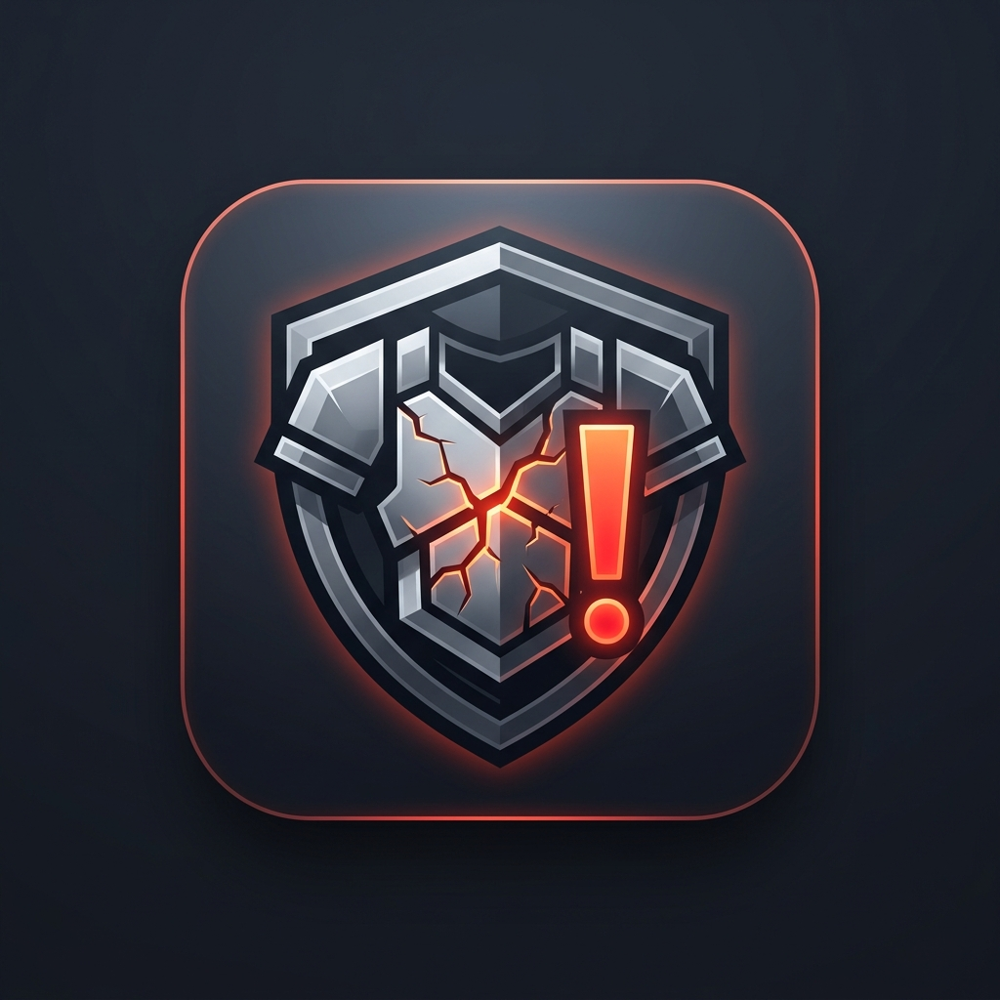

<p align="center">
  
</p>

# ArmorAlert

[](https://www.minecraft.net/)
[](https://fabricmc.net/)
[](https://opensource.org/licenses/MIT)
[](https://github.com/modclaim/armoralert)
[](https://modrinth.com/mod/armoralert)

**ArmorAlert** is a lightweight, fully client-side Fabric mod for Minecraft 26.3 that integrates an unobtrusive armor and offhand durability HUD directly adjacent to the vanilla hotbar. Never lose critical gear to unexpected breakage again.

---

## Features

- **Armor Slots HUD (Left of Hotbar)**: Displays equipped Helmet, Chestplate, Leggings, and Boots in dedicated read-only slots with real-time colored durability bars and exact percentage indicators.
- **Offhand Slot HUD (Right of Hotbar)**: Displays the currently held offhand item (such as a Shield, Totem of Undying, or tool) along with durability tracking where applicable.
- **Animated Warning Alerts**:
  - **Warning Threshold (Default 30%)**: An animated bouncing `❗` icon appears above the affected item when durability drops to or below the warning level.
  - **Critical Threshold (Default 10%)**: An animated bouncing `‼️` icon with an accelerated bounce frequency alerts you when gear is near breaking point.
- **In-Game Configuration GUI**: Press `K` (configurable) at any time to open the configuration menu.
- **Granular Customization**:
  - Toggle individual visibility for each armor and offhand slot.
  - Customize warning and critical threshold percentages.
  - Fine-tune positioning with individual per-slot X and Y screen offsets.
- **Optional ModMenu Integration**: If [ModMenu](https://modrinth.com/mod/modmenu) is installed, the settings screen is accessible directly from the Mods menu.
- **100% Client-Side**: No server-side installation required. Safe to use in singleplayer and on any vanilla or modded multiplayer server.

---

## Hotbar HUD Layout

The HUD frames the vanilla hotbar without obstructing core gameplay elements:

```text
       +---------+---------+---------+---------+   +=======================+   +---------+
       | HELMET  |  CHEST  |  LEGS   |  BOOTS  |   |                       |   | OFFHAND |
Alert: |   [!]   |         |         |  [!!]   |   |    VANILLA HOTBAR     |   |         |
Dur%:  |   28%   |   94%   |   85%   |   08%   |   |       SLOTS 1-9       |   |  Totem  |
Bar:   | [==== ] | [======]| [======]| [=    ] |   |                       |   | [N/A  ] |
       +---------+---------+---------+---------+   +=======================+   +---------+
       |<---------------- LEFT --------------->|                               |<--RIGHT->|
```

---

## Installation

### Requirements

- **Minecraft**: `26.3`
- **Fabric Loader**: `0.19.5` or higher
- **Java**: `21` or higher
- **Fabric API**: `0.160.7+26.3` *(Optional, recommended for maximum compatibility)*
- **ModMenu**: *(Optional, provides an in-game mod list entry for the config screen)*

### Steps

1. Install [Fabric Loader](https://fabricmc.net/use/) for Minecraft 26.3.
2. Download the latest `armoralert-1.0.0.jar` from [Releases](https://github.com/shokirovmuhammaddiyor/armoralert/releases) or [Modrinth](https://modrinth.com/mod/armoralert).
3. Place the `.jar` file into your `.minecraft/mods` directory.
4. Launch Minecraft using your Fabric profile.

---

## Usage & Controls

- Once in-game, the HUD automatically renders whenever you have armor equipped or an item in your offhand.
- If an item's durability drops to or below **30%**, the bouncing `❗` warning alert activates above the slot.
- If durability drops to or below **10%**, the warning upgrades to a fast-bouncing `‼️` critical alert.
- Press **`K`** in-game to open the configuration screen and adjust settings live.

### Keybinds

| Action | Default Key | Configurable | Location |
| :--- | :---: | :---: | :--- |
| Open ArmorAlert Settings | `K` | Yes | **Options** > **Controls** > **Key Binds** > **ArmorAlert** |

---

## Configuration

Settings can be adjusted via the in-game GUI (press `K` or through ModMenu) or by manually editing `.minecraft/config/armoralert.json`.

### Settings Reference

| Option | Type | Default | Description |
| :--- | :---: | :---: | :--- |
| `warningThreshold` | Integer (%) | `30` | Durability percentage that triggers the bouncing `❗` icon. |
| `criticalThreshold` | Integer (%) | `10` | Durability percentage that triggers the fast bouncing `‼️` icon. |
| `showHelmet` | Boolean | `true` | Toggle HUD rendering for the helmet slot. |
| `showChestplate` | Boolean | `true` | Toggle HUD rendering for the chestplate slot. |
| `showLeggings` | Boolean | `true` | Toggle HUD rendering for the leggings slot. |
| `showBoots` | Boolean | `true` | Toggle HUD rendering for the boots slot. |
| `showOffhand` | Boolean | `true` | Toggle HUD rendering for the offhand slot. |
| `showDurabilityBar` | Boolean | `true` | Displays color-coded durability status bars under item icons. |
| `showDurabilityPercent` | Boolean | `true` | Displays numeric percentage values on item slots. |
| `slotOffsets` | Map (X, Y) | `0, 0` | Custom X and Y pixel offsets for each individual HUD slot. |

---

## Compatibility

- **Multiplayer**: Fully client-side. Works on vanilla, Fabric, Paper, Purpur, Spigot, and Forge/NeoForge servers without server plugins.
- **Rendering & Performance Mods**: Compatible with Sodium, Iris Shaders, and Indium.
- **ModMenu**: Integrates natively; adds an interactive settings button inside ModMenu's mod catalog.
- **External Dependencies**: None required. Operates standalone on Fabric Loader.

---

## Contributing

Contributions, bug reports, and suggestions are welcome!

1. Fork the repository at [github.com/shokirovmuhammaddiyor/armoralert](https://github.com/shokirovmuhammaddiyor/armoralert).
2. Create your feature branch (`git checkout -b feature/amazing-feature`).
3. Commit your changes (`git commit -m 'Add amazing feature'`).
4. Push to the branch (`git push origin feature/amazing-feature`).
5. Open a Pull Request.

If you encounter issues, please submit an issue on the [GitHub Issue Tracker](https://github.com/shokirovmuhammaddiyor/armoralert/issues).

---

## License

Distributed under the **MIT License**. See [LICENSE](https://github.com/shokirovmuhammaddiyor/armoralert/blob/main/LICENSE) for more information.
